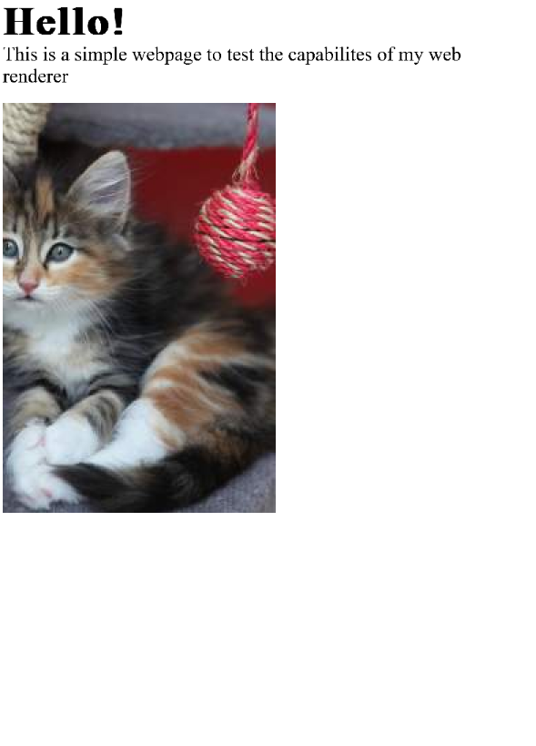

# opilio
A primitive web renderer written in Rust + SDL, mostly as learning expierence and to learn how "real" web renderers work

|  |
| :----: |
| *A very simplistic website rendered by opilio* |

## Supports
- [x] Text
- [x] Headings
- [x] Images (local or HTTP)
- [x] Link formatting
- [x] Scrolling
- [x] Word wrapping / window resizing 
## opilio?
The name opilio is based on the [scientific name for harvestmen](https://en.wikipedia.org/wiki/Opiliones).

Harvestmen don't produce webs, so they are obviously quite primitive when it comes to them
